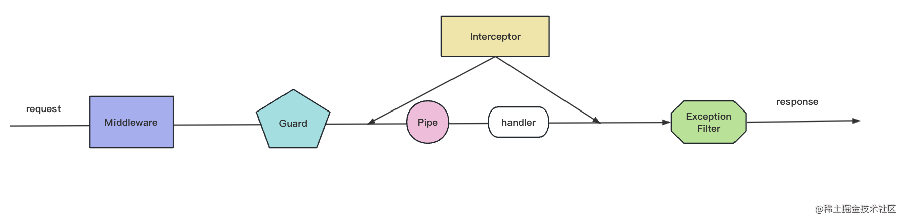

nest 在 @nestjs/cli 包里提供了 nest 命令，它可以用来做很多事情：

生成项目结构和各种代码
编译代码
监听文件变动自动编译
打印项目依赖信息
也就是这些子命令：

nest new 快速创建项目
nest generate / nest g 快速生成各种代码
nest build 使用 tsc 或者 webpack 构建代码
nest start 启动开发服务，支持 watch 和调试
nest info 打印 node、npm、nest 包的依赖版本
并且，很多选项都可以在 nest-cli.json 里配置，比如 generateOptions、compilerOptions 等。

## 5种http数据传输方式
1. url params
`http://guang.zxg/person/1111`
2. query params
`http://guang.zxg/person?name=guang&age=20`
这里的 name 和 age 就是 query 传递的数据。

其中非英文的字符和一些特殊字符要经过编码，可以使用 encodeURIComponent 的 api 来编码：
```javascript
const query = "?name=" + encodeURIComponent('光') + "&age=20"
// ?name=%E5%85%89&age=20
```
或者使用封装了一层的 query-string 库来处理。
```javascript
const queryString = require('query-string');

queryString.stringify({
  name: '光',
  age: 20
});

// ?name=%E5%85%89&age=20
```

3. form-urlencoded
`Content-Type: application/x-www-form-urlencoded`
因为内容也是 query 字符串，所以也要用 encodeURIComponent 的 api 或者 query-string 库处理下。

这种格式也很容易理解，get 是把数据拼成 query 字符串放在 url 后面，于是表单的 post 提交方式的时候就直接用相同的方式把数据放在了 body 里。

通过 & 分隔的 form-urlencoded 的方式需要对内容做 url encode，如果传递大量的数据，比如上传文件的时候就不是很合适了，因为文件 encode 一遍的话太慢了，这时候就可以用 form-data。

4. form-data
`Content-Type: multipart/form-data`

这种方式是用来上传文件的，它的格式是比较复杂的，需要用到 boundary 来分隔不同的数据。

5. json
`Content-Type: application/json`
json 格式的数据传输是最简单的，也是最常用的，因为 json 格式的数据可以直接用 JSON.stringify 来处理，也可以直接用 JSON.parse 来解析。

## 断点调试
node 代码可以加上 --inspect 或者 --inspect-brk 启动调试 ws 服务，然后用 Chrome DevTools 或者 vscode debugger 连上来调试。

nest 项目的调试也是 node 调试，可以使用 nest start --debug 启动 ws 服务，然后在 vscode 里 attach 上来调试，也可以添加个调试配置来运行 npm run start:dev。

nest 项目最方便的调试方式还是在 VSCode 里添加 npm run start:dev 的调试配置。

此外，我们还理解了 logpoint、条件断点、异常断点等断点类型。

## 项目结构
通过 nest g resource 命令生成的典型资源包含以下几个主要文件，每个文件在架构中都有其特定的作用：

- Controller: 处理 HTTP 请求，调用服务方法。
  - 处理传入的 HTTP 请求并返回响应。
  - 路由请求到对应的服务方法。
  - 通常包含 HTTP 方法装饰器（如 @Get()、@Post() 等）和路由路径。

- Service: 处理业务逻辑，操作数据。
  - 包含业务逻辑，处理数据和执行各种操作。
  - 被控制器调用以处理请求。
  - 通常包含与数据库交互的逻辑。

- Module: 组织和管理相关的控制器和服务。
  - 组织和管理相关的控制器和服务。
  - 将控制器和服务注册到 NestJS 的依赖注入系统中。
  - 可以导入和导出其他模块。

- DTO: 定义数据结构，用于验证和转换数据。
  - 定义数据传输对象（DTO），用于描述数据结构。
  - 用于验证和转换传入的请求数据。

- Entity: 定义数据库实体结构（如果使用 ORM）
  - 定义实体类，用于描述数据库表的结构。
  - 通常与 ORM（如 TypeORM 或 Sequelize）一起使用。

- Spec 文件: 用于单元测试。
  - 包含测试用例，用于对控制器和服务进行单元测试。
  - 使用 Jest 或其他测试框架编写测试。

## AOP 面向切面编程
1. Middleware: 最早执行，用于处理请求的预处理。
2. Guard: 在路由处理之前执行，用于认证和授权。
3. Interceptor: 在控制器方法调用之前和之后执行，可以修改请求/响应。
4. Pipe: 在控制器方法调用之前执行，用于数据验证和转换。
5. Exception Filter: 在控制器方法抛出异常时执行，用于异常处理。


## Nest 全部的装饰器

@Module： 声明 Nest 模块
@Controller：声明模块里的 controller
@Injectable：声明模块里可以注入的 provider
@Inject：通过 token 手动指定注入的 provider，token 可以是 class 或者 string
@Optional：声明注入的 provider 是可选的，可以为空
@Global：声明全局模块
@Catch：声明 exception filter 处理的 exception 类型
@UseFilters：路由级别使用 exception filter
@UsePipes：路由级别使用 pipe
@UseInterceptors：路由级别使用 interceptor
@SetMetadata：在 class 或者 handler 上添加 metadata
@Get、@Post、@Put、@Delete、@Patch、@Options、@Head：声明 get、post、put、delete、patch、options、head 的请求方式
@Param：取出 url 中的参数，比如 /aaa/:id 中的 id
@Query: 取出 query 部分的参数，比如 /aaa?name=xx 中的 name
@Body：取出请求 body，通过 dto class 来接收
@Headers：取出某个或全部请求头
@Session：取出 session 对象，需要启用 express-session 中间件
@HostParm： 取出 host 里的参数
@Req、@Request：注入 request 对象
@Res、@Response：注入 response 对象，一旦注入了这个 Nest 就不会把返回值作为响应了，除非指定 passthrough 为true
@Next：注入调用下一个 handler 的 next 方法
@HttpCode： 修改响应的状态码
@Header：修改响应头
@Redirect：指定重定向的 url
@Render：指定渲染用的模版引擎
把这些装饰器用熟，就掌握了 nest 大部分功能了。

>这就是 nest 的核心实现原理：通过装饰器给 class 或者对象添加 metadata，并且开启 ts 的 emitDecoratorMetadata 来自动添加类型相关的 metadata，然后运行的时候通过这些元数据来实现依赖的扫描，对象的创建等等功能。

>Nest 的装饰器都是依赖 reflect-metadata 实现的，而且还提供了一个 @SetMetadata 的装饰器让我们可以给 class、method 添加一些 metadata